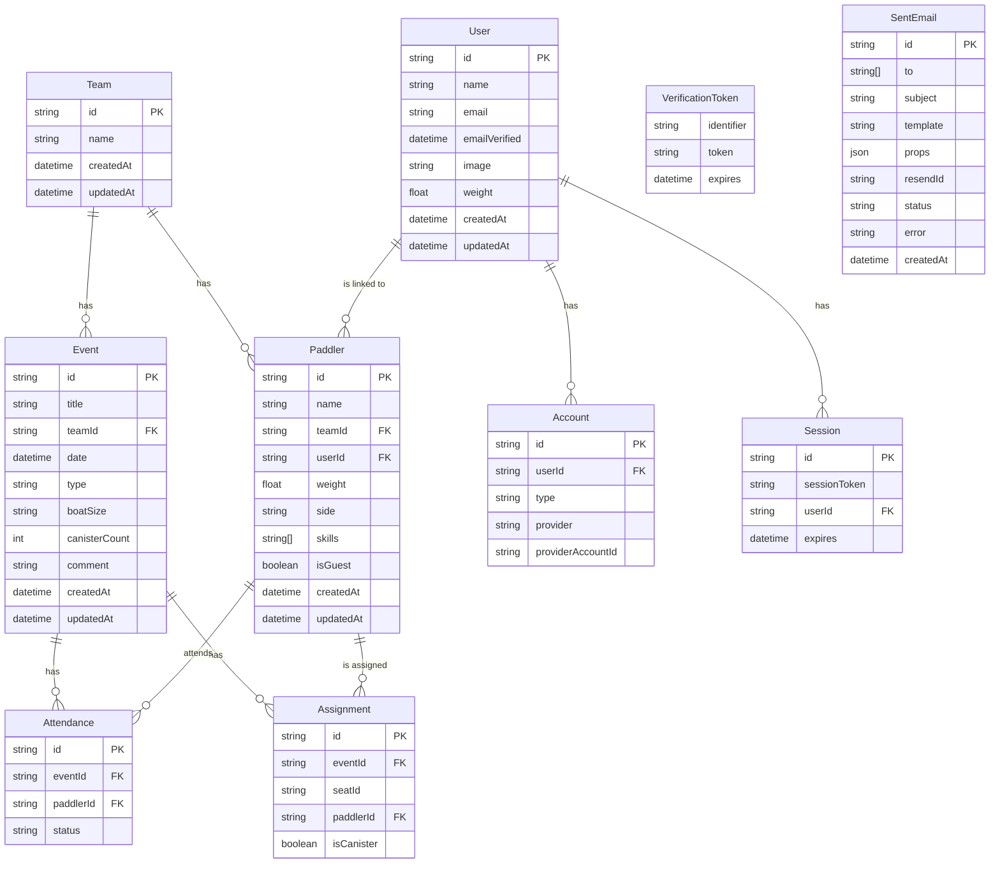

# Datenmodell - Drachenboot Manager

## Übersicht

Die Drachenboot Manager Anwendung verwendet **PostgreSQL** als Datenbank mit **Prisma** als ORM. Das Datenmodell ist auf Multi-Team-Support ausgelegt und ermöglicht die vollständige Trennung von Daten zwischen verschiedenen Teams.

## Entity Relationship Diagram



## Entities

### Team

Repräsentiert ein Drachenboot-Team. Jedes Team hat seine eigenen Paddler und Events.

| Feld | Typ | Beschreibung |
|------|-----|--------------|
| `id` | string (CUID) | Eindeutige Team-ID |
| `name` | string | Name des Teams |
| `createdAt` | datetime | Erstellungszeitpunkt |
| `updatedAt` | datetime | Letztes Update |

**Beziehungen:**
- Hat viele `Paddler`
- Hat viele `Event`s

### Paddler

Ein Mitglied eines Teams mit definierten Eigenschaften für die Bootsplanung.

| Feld | Typ | Beschreibung |
|------|-----|--------------|
| `id` | string (CUID) | Eindeutige Paddler-ID |
| `name` | string | Name des Paddlers |
| `teamId` | string? | Team-Zugehörigkeit (FK zu Team) |
| `userId` | string? | Verknüpftes Benutzerkonto (FK zu User) |
| `weight` | float | Gewicht in kg |
| `side` | string? | Bevorzugte Seite: `'left'`, `'right'`, `'both'` |
| `skills` | string[] | Fähigkeiten: `['drum', 'steer']` |
| `isGuest` | boolean | Gast-Paddler (temporär) |
| `createdAt` | datetime | Erstellungszeitpunkt |
| `updatedAt` | datetime | Letztes Update |

**Beziehungen:**
- Gehört zu einem `Team` (onDelete: Cascade)
- Kann zu einem `User` gehören (optional)
- Hat viele `Attendance`s
- Hat viele `Assignment`s

**Synchronisation:**
- `name` und `weight` werden vom verknüpften `User` Profil überschrieben, wenn der Benutzer sein Profil aktualisiert.
- `skills` werden spezifisch pro Team-Paddler gespeichert. Beim Update des User-Profils werden neue Skills übernommen, aber Spezialrollen wie `'stroke'` oder `'steer_preferred'` (die meist vom Kapitän vergeben werden) bleiben erhalten.

### User (Auth)

Ein registrierter Benutzer der Anwendung (für Login/Authentifizierung).

| Feld | Typ | Beschreibung |
|------|-----|--------------|
| `id` | string (CUID) | Eindeutige User-ID |
| `name` | string? | Name des Benutzers |
| `email` | string? | E-Mail-Adresse (Unique) |
| `emailVerified` | datetime? | Zeitpunkt der E-Mail-Verifizierung |
| `image` | string? | URL zum Profilbild |
| `weight` | float? | Gewicht des Benutzers (für Sync mit Paddler) |
| `createdAt` | datetime | Erstellungszeitpunkt |
| `updatedAt` | datetime | Letztes Update |

**Beziehungen:**
- Hat viele `Account`s (OAuth Provider)
- Hat viele `Session`s
- Hat viele `Paddler` (ein User kann in mehreren Teams als Paddler existieren)

### Account (Auth)

Speichert OAuth-Verbindungen (z.B. Google, GitHub) für einen Benutzer.

| Feld | Typ | Beschreibung |
|------|-----|--------------|
| `id` | string (CUID) | Eindeutige Account-ID |
| `userId` | string | User-Referenz (FK zu User) |
| `type` | string | Account-Typ (z.B. "oauth") |
| `provider` | string | Provider-Name (z.B. "google") |
| `providerAccountId` | string | ID beim Provider |
| ... | ... | Weitere OAuth-Token-Felder |

### Session (Auth)

Speichert aktive Login-Sitzungen.

| Feld | Typ | Beschreibung |
|------|-----|--------------|
| `id` | string (CUID) | Eindeutige Session-ID |
| `sessionToken` | string | Session-Token (Unique) |
| `userId` | string | User-Referenz (FK zu User) |
| `expires` | datetime | Ablaufzeitpunkt |

### VerificationToken (Auth)

Speichert Tokens für E-Mail-Verifizierung (Magic Links).

| Feld | Typ | Beschreibung |
|------|-----|--------------|
| `identifier` | string | E-Mail-Adresse |
| `token` | string | Verifizierungs-Token (Unique) |
| `expires` | datetime | Ablaufzeitpunkt |

### SentEmail

Loggt alle gesendeten E-Mails für Debugging und Auditing.

| Feld | Typ | Beschreibung |
|------|-----|--------------|
| `id` | string (CUID) | Eindeutige E-Mail-ID |
| `to` | string[] | Empfänger-Adressen |
| `subject` | string | Betreff |
| `template` | string | Template-Name (z.B. "WelcomeEmail") |
| `props` | json? | Template-Props für Debugging |
| `resendId` | string? | ID von Resend API |
| `status` | string | Status: `"sent"` oder `"failed"` |
| `error` | string? | Fehlermeldung (bei Fehler) |
| `createdAt` | datetime | Versandzeitpunkt |

### Event

Ein Training oder eine Regatta mit Datum und Teilnehmerliste.

| Feld | Typ | Beschreibung |
|------|-----|--------------|
| `id` | string (UUID) | Eindeutige Event-ID |
| `title` | string | Titel des Events |
| `teamId` | string? | Team-Zugehörigkeit (FK zu Team) |
| `date` | datetime | Datum und Uhrzeit |
| `type` | string | Typ: `"training"` oder `"regatta"` |
| `boatSize` | string | Bootsgröße: `"standard"` (20) oder `"small"` (10) |
| `canisterCount` | int | Anzahl der Kanister-Platzhalter |
| `comment` | string? | Optionaler Kommentar / Notiz |
| `createdAt` | datetime | Erstellungszeitpunkt |
| `updatedAt` | datetime | Letztes Update |

**Beziehungen:**
- Gehört zu einem `Team` (onDelete: Cascade)
- Hat viele `Attendance`s
- Hat viele `Assignment`s

### Attendance

Verknüpft Paddler mit Events und speichert deren Zu-/Absage-Status.

| Feld | Typ | Beschreibung |
|------|-----|--------------|
| `id` | string (CUID) | Eindeutige Attendance-ID |
| `eventId` | string | Event-Referenz (FK zu Event) |
| `paddlerId` | string | Paddler-Referenz (FK zu Paddler) |
| `status` | string | Status: `'yes'`, `'no'`, `'maybe'` |

**Constraints:**
- Unique Constraint auf `(eventId, paddlerId)` - Ein Paddler kann nur eine Zu-/Absage pro Event haben

**Beziehungen:**
- Gehört zu einem `Event` (onDelete: Cascade)
- Gehört zu einem `Paddler` (onDelete: Cascade)

### Assignment

Speichert die Bootsbesetzung für ein Event (welcher Paddler sitzt auf welchem Platz).

| Feld | Typ | Beschreibung |
|------|-----|--------------|
| `id` | string (CUID) | Eindeutige Assignment-ID |
| `eventId` | string | Event-Referenz (FK zu Event) |
| `seatId` | string | Platz-ID (z.B. `'row-1-left'`, `'drummer'`, `'steer'`) |
| `paddlerId` | string? | Paddler-Referenz (FK zu Paddler, optional) |
| `isCanister` | boolean | Ist dies ein Kanister-Platzhalter? |

**Constraints:**
- Unique Constraint auf `(eventId, seatId)` - Ein Platz kann nur einem Paddler zugewiesen werden

**Beziehungen:**
- Gehört zu einem `Event` (onDelete: Cascade)
- Gehört zu einem `Paddler` (onDelete: Cascade, optional)

## Wichtige Design-Entscheidungen

### Cascade Delete

Alle Beziehungen zu `Team`, `Event`, und `Paddler` verwenden `onDelete: Cascade`:
- Wenn ein **Team** gelöscht wird, werden alle zugehörigen Paddler und Events (und deren Attendances/Assignments) automatisch gelöscht
- Wenn ein **Event** gelöscht wird, werden alle Attendances und Assignments gelöscht
- Wenn ein **Paddler** gelöscht wird, werden alle Attendances und Assignments gelöscht

### Seat IDs

Die `seatId` in `Assignment` folgt einem definierten Schema:

**Standard Boot (20 Paddler):**
- Paddler: `row-1-left`, `row-1-right`, `row-2-left`, ..., `row-10-right` (20 Plätze)
- Spezial: `drummer`, `steer`

**Kleines Boot (10 Paddler):**
- Paddler: `row-1-left`, `row-1-right`, `row-2-left`, ..., `row-5-right` (10 Plätze)
- Spezial: `drummer`, `steer`

### Gäste vs. reguläre Paddler

Paddler haben ein `isGuest` Flag:
- **Reguläre Paddler** (`isGuest = false`): Permanente Team-Mitglieder
- **Gäste** (`isGuest = true`): Temporäre Paddler, die nur für bestimmte Events hinzugefügt werden

### Kanister

Kanister sind Platzhalter mit einem Standardgewicht von 25kg. Sie werden in `Assignment` durch `isCanister = true` markiert und haben keinen verknüpften `paddlerId`.

## Datenbank-Migrationen

Das Projekt nutzt Prisma Migrations:

```bash
# Neue Migration erstellen
npx prisma migrate dev --name <migration_name>

# Migration anwenden (Production)
npx prisma migrate deploy

# Prisma Client neu generieren
npx prisma generate

# Datenbank zurücksetzen (Development)
npx prisma migrate reset
```

## Beispiel-Queries

### Alle Paddler eines Teams abrufen
```typescript
const paddlers = await prisma.paddler.findMany({
  where: { teamId: 'team-id' }
});
```

### Event mit allen Zusagen erstellen
```typescript
const event = await prisma.event.create({
  data: {
    title: 'Training',
    teamId: 'team-id',
    date: new Date(),
    type: 'training',
    boatSize: 'standard'
  }
});
```

### Bootsbesetzung speichern
```typescript
await prisma.assignment.create({
  data: {
    eventId: 'event-id',
    seatId: 'row-1-left',
    paddlerId: 'paddler-id',
    isCanister: false
  }
});
```

### Team mit allen Daten löschen
```typescript
// Cascade Delete kümmert sich um alle Relationen
await prisma.team.delete({
  where: { id: 'team-id' }
});
```

## Performance-Optimierungen

1. **Indizes**: Alle FK-Felder (`teamId`, `eventId`, `paddlerId`) sind automatisch indiziert durch Prisma
2. **Unique Constraints**: Verhindern Duplikate und ermöglichen schnelle Lookups
3. **Selective Loading**: Use Prisma `select` und `include` um nur benötigte Daten zu laden

---

Für API-Endpunkte siehe [API Documentation](docs/API.md)
